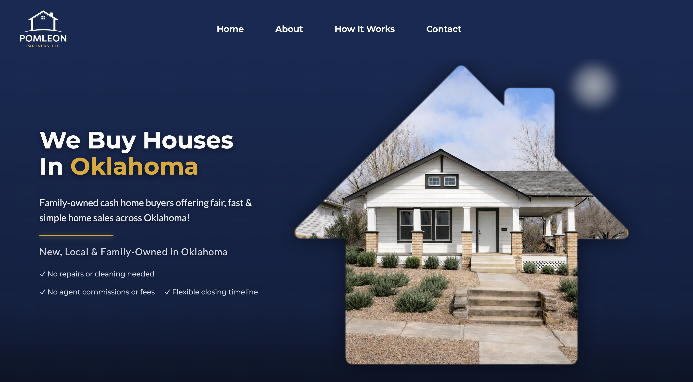

# Pomleon Partners Landing Page

🔗 [Live Demo](https://pomleon.com/)  
> ⚠️ Note: The live site may change as the full-stack version is deployed.  
> Built as an initial production ready solution for a real client.

---

A temporary landing page built for Pomleon Partners, a family owned real estate business in Oklahoma.

This page was designed to establish an online presence while the full-stack website is currently in development.

---

## PURPOSE

The goal of this project was to..

- provide a simple and professional online presence  
- communicate what the business does clearly  
- build trust with potential sellers  
- hold space for future expansion into a full website  

---

## TECH STACK

- React ( component-based UI )  
- Vite ( development & build tool )  
- Node.js / npm ( project tooling )  
- CSS ( custom styling )  

---

## KEY FEATURES

- responsive layout across devices  
- brand focused color system  
- lightweight and fast  

---

## 🚧 IN PROGRESS

This landing page will evolve into a full application with..

- contact + lead capture system  
- backend integration  
- multi-page experience  
- enhanced UX  

---

## Reflection

this project represents an early-stage product mindset... 
building something real, useful, and immediate while planning for scale.

---

## Built By

**Skie**  
Full-Stack Developer | Building real-world web experiences
